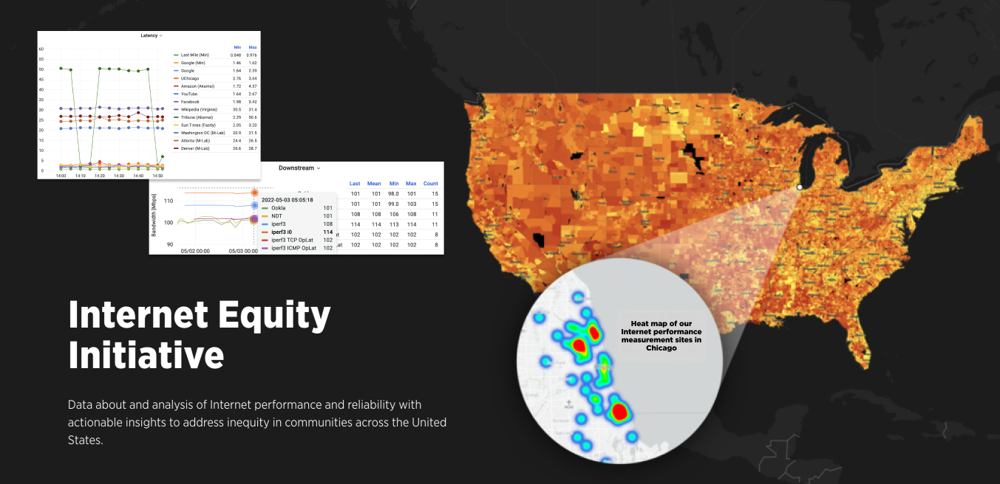

# Netrics Data - Continuous Measurements of Internet Performance at the Access Network

This repository contains documentation about and links to datasets collected by Netrics Internet measurement devices which the [Internet Equity Initiative](internetequity.uchicago.edu) research team at the [Data Science Institute](datascience.uchicago.edu) deployed across Chicago starting in late 2021. Supporting resources to assist those that want to use the data are also available.

This repository is organized as follows:
- **documentation**: Find documentation about the data, the deployment of Netrics devices, and the pipeline that moves data from devices to a central data store.
- **example-notebooks**: Find Jupyter notebooks with example code for working with the Netrics data and notebooks containing the analysis underlying some of the data stories on the portal.
- **data**: Find datasets used in some of the data stories featured on the portal.
- **src**: Find scripts used to pull data from InfluxDB.

## Download the Data

### [*Version 1.0*](https://github.com/chicago-cdac/netrics-data/releases/tag/data) (May 9, 2022)

## Additional Links

- Visit our [portal](internetequity.uchicago.edu) for the initiative
- Visit our webpage on the Data Science Institute [website](http://datascience.uchicago.edu/research/internet-access-equity-initiative/)
- View the open-source code for the Netrics [software](https://github.com/chicago-cdac/nm-exp-active-netrics)

Please [create an issue](https://github.com/chicago-cdac/netrics-data/issues) if you want to flag errors in the data or make suggestions on how to improve the data for the research team.

For questions about the above, contact us at [broadband-equity@lists.uchicago.edu](mailto:broadband-equity@lists.uchicago.edu).
