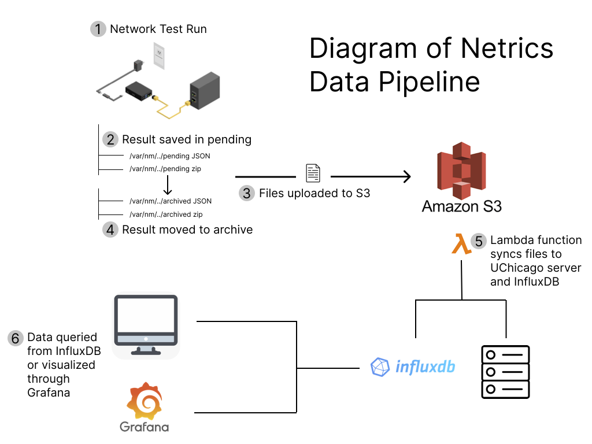

# Netrics Data Pipeline

In this document, we will explain the process by which Internet performance and reliability data collected by our Netrics devices is transferred and stored after measurement.

## How Netrics Data Is Collected

As explained in [this document](./netrics-deployment.md), Netrics devices are shipped to households around Chicago, where they are installed at the Internet access point and begin running multiple network performance tests many times per day. Each time a test is run, the [Netrics measurement software](https://github.com/chicago-cdac/nm-exp-active-netrics) saves both a zipfile of the raw output of the test as well as a JSON with data parsed from the raw output. These files are saved on the device's local file system in a designated `pending` directory.

After the zipfile and JSON file of a test run are saved to the `pending` directory, another package installed on the device periodically checks the `pending` directory and, if it sees files sitting in the directory, begins a process to upload those files to a bucket on [Amazon's S3](https://aws.amazon.com/s3/) cloud object storage. After the files are uploaded to S3, two [Lambda](https://aws.amazon.com/lambda/?trk=12eea001-bcfd-40ce-9788-748f73400e32&sc_channel=ps&sc_campaign=acquisition&sc_medium=ACQ-P|PS-GO|Non-Brand|Desktop|SU|Compute|Solution|US|EN|DSA&s_kwcid=AL!4422!3!579354349672!!!g!!&trk=12eea001-bcfd-40ce-9788-748f73400e32&sc_channel=ps&sc_campaign=acquisition&sc_medium=ACQ-P|PS-GO|Non-Brand|Desktop|SU|Compute|Solution|US|EN|DSA&ef_id=Cj0KCQjwgYSTBhDKARIsAB8KukuHhaUqjLEKc6iqL_Fk8VHu0IXLmvxjJZ6fjj1MO7KWhV1iB30D3DkaArFCEALw_wcB:G:s&s_kwcid=AL!4422!3!579354349672!!!g!!) functions running in the cloud take the JSON files from S3 and write the data contained to an [InfluxDB](https://www.influxdata.com/) instance running on a server at the University of Chicago. Separately, the files on S3 are synced to the file system on another server located at the University of Chicago and managed by the research team. The Influx database connects directly to a [Grafana](https://grafana.com/) frontend, which allows the research team to visualize the data almost in real-time as it comes in from each active device in the field.

## Future Development

The [data downloads](https://github.com/chicago-cdac/netrics-data/releases/tag/netrics-data-1-2) that we have made available through this repository are CSV files that the research team queried from the InfluxDB. While the file downloads allow us to share these data with the public in the short term, the research team plans to develop an API that will allow others to query the data directly based on parameters such as device location, time range, and measurement types in the near future. This feature will be added to the [Internet Equity Portal](https://internetequity.uchicago.edu/) once it is ready.